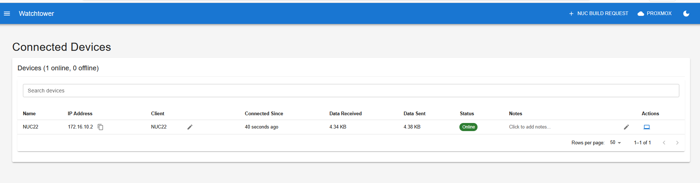

# Watchtower

A centralized infrastructure management application for penetration testing environments.
<p align="center">
  
</p>

## Overview

Watchtower provides a unified dashboard for monitoring connected devices, managing virtual machines, accessing knowledge bases, and tracking tasks. It's designed as a centralized hub for pentesting infrastructure management.

### Key Features

- **Connected Devices Dashboard**: Real-time monitoring of OpenVPN connected devices
- **Proxmox VM Management**: Deploy, manage, and access virtual machines
- **Knowledge Base**: Pentesting documentation with Atlassian Confluence integration
- **Task Board**: Project management with Trello integration
- **NUC Build Requests**: Form for requesting device builds

## Project Structure

- **frontend/**: React application (JavaScript) with Material UI, using MVC architecture
- **backend-server/**: Node.js Express server connecting to OpenVPN management interface and Proxmox API

## Prerequisites

- Node.js 18+ and npm
- OpenVPN server with management interface enabled
- Access to OpenVPN management interface (typically on port 7505)

## Setup

### 1. Configure OpenVPN Management Interface

Make sure your OpenVPN server has the management interface enabled. Add this to your OpenVPN server configuration:

```
management localhost 7505
```

Or if you need password protection:

```
management localhost 7505 /path/to/password-file
```

### 2. Backend Server Setup

```bash
# Navigate to backend-server directory
cd backend-server

# Install dependencies
npm install

# Set environment variables (optional)
export OPENVPN_HOST=localhost
export OPENVPN_PORT=7505
export OPENVPN_PASSWORD=your_password_if_needed
export PORT=8080

# Start the server
npm start
```

Or create a `.env` file in `backend-server/`:

```env
# OpenVPN Configuration
OPENVPN_HOST=localhost
OPENVPN_PORT=7505
OPENVPN_PASSWORD=

# Proxmox Configuration (optional)
PROXMOX_HOST=your-proxmox-host
PROXMOX_PORT=8006
PROXMOX_USER=root
PROXMOX_REALM=pam
PROXMOX_TOKEN_ID=your-token-id
PROXMOX_TOKEN_SECRET=your-token-secret

# Server Configuration
PORT=8080
```

### 3. Frontend Setup

```bash
# Navigate to frontend directory
cd frontend

# Install dependencies
npm install

# Start development server
npm run dev
```

The frontend will be available at `http://localhost:5173` (or the port Vite assigns).

## Production Build

### Backend

```bash
cd backend-server
npm install
npm start
```

### Frontend

```bash
cd frontend
npm install
npm run build
```

The built files will be in `frontend/dist/`. You can serve them with any static file server or use the provided nginx configuration.

## Environment Variables

### Backend Server

**OpenVPN Configuration:**
- `OPENVPN_HOST`: OpenVPN server hostname (default: localhost)
- `OPENVPN_PORT`: OpenVPN management interface port (default: 7505)
- `OPENVPN_PASSWORD`: Password for management interface (if required)

**Proxmox Configuration (optional):**
- `PROXMOX_HOST`: Proxmox server hostname
- `PROXMOX_PORT`: Proxmox API port (default: 8006)
- `PROXMOX_USER`: Proxmox username
- `PROXMOX_REALM`: Authentication realm (default: pam)
- `PROXMOX_TOKEN_ID`: API token ID
- `PROXMOX_TOKEN_SECRET`: API token secret

**Server Configuration:**
- `PORT`: Backend server port (default: 8080)

### Frontend

**Optional API Integrations:**
- `VITE_API_URL`: Backend API URL (default: empty, uses proxy in dev)
- `VITE_ATLASSIAN_BASE_URL`: Atlassian Confluence base URL (for Knowledge Base)
- `VITE_ATLASSIAN_EMAIL`: Atlassian account email
- `VITE_ATLASSIAN_API_TOKEN`: Atlassian API token
- `VITE_TRELLO_API_KEY`: Trello API key (for Task Board)
- `VITE_TRELLO_API_TOKEN`: Trello API token

## Features

### Dashboard (Connected Devices)
- **Real-time Updates**: Automatically refreshes device list every 5 seconds
- **Search**: Filter devices by name, IP address, client name, or notes
- **Device Management**: Editable client names and notes (saved to localStorage)
- **RDP Integration**: Quick RDP connection to devices
- **Offline Tracking**: Maintains history of disconnected devices

### Proxmox VM Management
- **VM Operations**: Deploy, start, stop, delete virtual machines
- **Pool Organization**: Organize VMs by storage pools
- **VNC Console**: Web-based console access
- **ISO/Template Support**: Deploy from ISOs or clone existing VMs

### Knowledge Base
- **Confluence Integration**: Sync with Atlassian Confluence
- **Local Storage**: Fallback to local storage when API not configured
- **Search**: Full-text search across all pages
- **Markdown Support**: Rich content formatting

### Task Board
- **Trello Integration**: Sync with Trello boards
- **Kanban View**: Visual task management
- **Card Management**: Create, edit, move, and delete tasks

### General Features
- **Dark/Light Theme**: OLED-friendly dark mode with theme persistence
- **Responsive Design**: Works on desktop and mobile devices
- **MVC Architecture**: Modular, scalable codebase structure

## API Endpoints

See [docs/api/backend-api.md](./docs/api/backend-api.md) for complete API documentation.

**OpenVPN:**
- `GET /api/devices` - Get list of all connected OpenVPN devices

**Proxmox:**
- `GET /api/proxmox/vms` - Get all VMs
- `GET /api/proxmox/nodes` - Get Proxmox nodes
- `POST /api/proxmox/vms/deploy` - Deploy new VM
- `DELETE /api/proxmox/vms/:node/:vmid` - Delete VM
- `POST /api/proxmox/vms/:node/:vmid/start` - Start VM
- `POST /api/proxmox/vms/:node/:vmid/stop` - Stop VM
- `GET /api/proxmox/vms/:node/:vmid/vnc` - Get VNC console URL
- `GET /api/proxmox/pools` - Get storage pools
- `PUT /api/proxmox/vms/:node/:vmid/pool` - Update VM pool

**General:**
- `GET /api/health` - Health check endpoint

## Troubleshooting

### Cannot connect to OpenVPN management interface

1. Verify OpenVPN management interface is enabled in your server config
2. Check that the management port is accessible (default 7505)
3. Verify firewall rules allow connections to the management port
4. If using password authentication, ensure `OPENVPN_PASSWORD` is set correctly

### No devices showing

1. Check that devices are actually connected to OpenVPN
2. Verify the backend server can connect to OpenVPN management interface
3. Check backend server logs for errors
4. Ensure OpenVPN management interface is responding to status commands

## Documentation

Comprehensive documentation is available in the `docs/` folder:
- [Documentation Overview](./docs/README.md)
- [Dashboard Page](./docs/pages/dashboard.md)
- [NUC Build Request](./docs/pages/nuc-build-request.md)
- [Proxmox Management](./docs/pages/proxmox.md)
- [Knowledge Base](./docs/pages/knowledge-base.md)
- [Task Board](./docs/pages/task-board.md)
- [Backend API Reference](./docs/api/backend-api.md)

## Architecture

The application uses an MVC (Model-View-Controller) architecture:

- **Models**: Data layer - API services and business logic (`src/models/`)
- **Views**: Presentation layer - React components (`src/views/`)
- **Controllers**: Coordination layer - State management and hooks (`src/controllers/`)

This structure provides:
- **Modularity**: Clear separation of concerns
- **Scalability**: Easy to add new features
- **Maintainability**: Organized, readable codebase

## License

MIT
